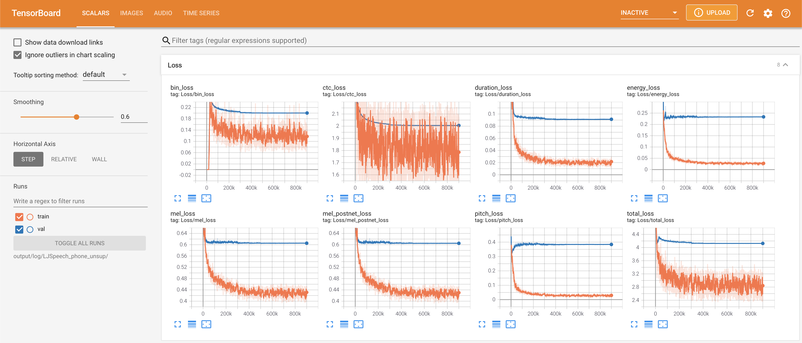
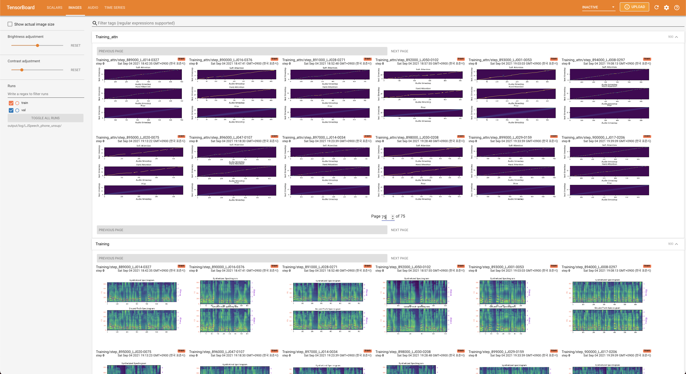
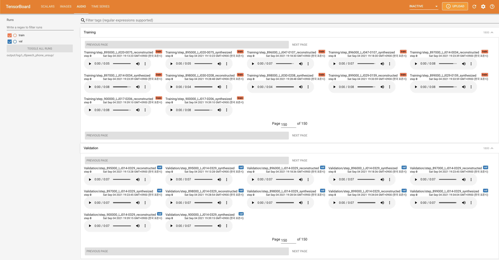

# Comprehensive-Transformer-TTS - PyTorch Implementation

**A Non-Autoregressive Transformer** based TTS, supporting a family of SOTA transformers with supervised and unsupervised duration modelings. This project grows with the research community, **aiming to achieve the ultimate TTS**. Any suggestions toward the best Non-AR TTS are welcome :)

### Transformers
- [x] [Fastformer: Additive Attention Can Be All You Need](https://arxiv.org/abs/2108.09084) (Wu et al., 2021)
- [x] [Long-Short Transformer: Efficient Transformers for Language and Vision](https://arxiv.org/abs/2107.02192) (Zhu et al., 2021)
- [x] [Conformer: Convolution-augmented Transformer for Speech Recognition](https://arxiv.org/abs/2005.08100) (Gulati et al., 2020)
- [x] [Reformer: The Efficient Transformer](https://arxiv.org/abs/2001.04451) (Kitaev et al., 2020)
- [x] [Attention Is All You Need](https://arxiv.org/abs/1706.03762) (Vaswani et al., 2017)

### Prosody Modelings (WIP)
- [x] [Rich Prosody Diversity Modelling with Phone-level Mixture Density Network](https://arxiv.org/abs/2102.00851) (Du et al., 2021)

### Supervised Duration Modelings
- [x] [FastSpeech 2: Fast and High-Quality End-to-End Text to Speech](https://arxiv.org/abs/2006.04558) (Ren et al., 2020)

### Unsupervised Duration Modelings
- [x] [One TTS Alignment To Rule Them All](https://arxiv.org/abs/2108.10447) (Badlani et al., 2021): We are finally freed from external aligners such as MFA! Validation alignments for LJ014-0329 up to 70K are shown below as an example.

  <p align="center">
      
  </p>

### Transformer Performance Comparison on LJSpeech (1 TITAN RTX 24G / 16 batch size)
| Model | Memory Usage | Training Time (1K steps) |
| --- | ----------- | ----- |
|Fastformer (lucidrains')|10531MiB / 24220MiB|4m 25s
|Fastformer (wuch15's)|10515MiB / 24220MiB|4m 45s
|Long-Short Transformer|10633MiB / 24220MiB|5m 26s
|Conformer|18903MiB / 24220MiB|7m 4s
|Reformer|10293MiB / 24220MiB|10m 16s
|Transformer|7909MiB / 24220MiB|4m 51s

Toggle the type of building blocks by
```yaml
# In the model.yaml
block_type: "transformer" # ["transformer", "fastformer", "lstransformer", "conformer", "reformer"]
```

Toggle the type of prosody modelings by
```yaml
# In the model.yaml
prosody:
  learn_mixture: True # for (Du et al., 2021)
```

Toggle the type of duration modelings by
```yaml
# In the model.yaml
duration_modeling:
  learn_alignment: True # for unsupervised modeling, False for supervised modeling
```

# Quickstart

***DATASET*** refers to the names of datasets such as `LJSpeech` and `VCTK` in the following documents.

## Dependencies
You can install the Python dependencies with
```
pip3 install -r requirements.txt
```
Also, `Dockerfile` is provided for `Docker` users.

## Inference

You have to download the [pretrained models](https://drive.google.com/drive/folders/1xEOVbv3PLfGX8EgEkzg1014c9h8QMxQ-?usp=sharing) and put them in `output/ckpt/DATASET/`. The models are trained with unsupervised duration modeling under transformer building block.

For a **single-speaker TTS**, run
```
python3 synthesize.py --text "YOUR_DESIRED_TEXT" --restore_step RESTORE_STEP --mode single --dataset DATASET
```

For a **multi-speaker TTS**, run
```
python3 synthesize.py --text "YOUR_DESIRED_TEXT" --speaker_id SPEAKER_ID --restore_step RESTORE_STEP --mode single --dataset DATASET
```

The dictionary of learned speakers can be found at `preprocessed_data/DATASET/speakers.json`, and the generated utterances will be put in `output/result/`.


## Batch Inference
Batch inference is also supported, try

```
python3 synthesize.py --source preprocessed_data/DATASET/val.txt --restore_step RESTORE_STEP --mode batch --dataset DATASET
```
to synthesize all utterances in `preprocessed_data/DATASET/val.txt`.

## Controllability
The pitch/volume/speaking rate of the synthesized utterances can be controlled by specifying the desired pitch/energy/duration ratios.
For example, one can increase the speaking rate by 20 % and decrease the volume by 20 % by

```
python3 synthesize.py --text "YOUR_DESIRED_TEXT" --restore_step RESTORE_STEP --mode single --dataset DATASET --duration_control 0.8 --energy_control 0.8
```
Add ***--speaker_id SPEAKER_ID*** for a multi-speaker TTS.

# Training

## Datasets

The supported datasets are

- [LJSpeech](https://keithito.com/LJ-Speech-Dataset/): a **single-speaker** English dataset consists of 13100 short audio clips of a female speaker reading passages from 7 non-fiction books, approximately 24 hours in total.
- [VCTK](https://datashare.ed.ac.uk/handle/10283/3443): The CSTR VCTK Corpus includes speech data uttered by 110 English speakers (**multi-speaker TTS**) with various accents. Each speaker reads out about 400 sentences, which were selected from a newspaper, the rainbow passage and an elicitation paragraph used for the speech accent archive.

Any of both **single-speaker TTS** dataset (e.g., [Blizzard Challenge 2013](https://www.synsig.org/index.php/Blizzard_Challenge_2013)) and **multi-speaker TTS** dataset (e.g., [LibriTTS](https://openslr.org/60/)) can be added following LJSpeech and VCTK, respectively. Moreover, **your own language and dataset** can be adapted following [here](https://github.com/keonlee9420/Expressive-FastSpeech2).

## Preprocessing

- For a **multi-speaker TTS** with external speaker embedder, download [ResCNN Softmax+Triplet pretrained model](https://drive.google.com/file/d/1F9NvdrarWZNktdX9KlRYWWHDwRkip_aP) of [philipperemy's DeepSpeaker](https://github.com/philipperemy/deep-speaker) for the speaker embedding and locate it in `./deepspeaker/pretrained_models/`.
- Run 
  ```
  python3 prepare_align.py --dataset DATASET
  ```
  for some preparations.

  For the forced alignment, [Montreal Forced Aligner](https://montreal-forced-aligner.readthedocs.io/en/latest/) (MFA) is used to obtain the alignments between the utterances and the phoneme sequences.
  Pre-extracted alignments for the datasets are provided [here](https://drive.google.com/drive/folders/1fizpyOiQ1lG2UDaMlXnT3Ll4_j6Xwg7K?usp=sharing). 
  You have to unzip the files in `preprocessed_data/DATASET/TextGrid/`. Alternately, you can [run the aligner by yourself](https://montreal-forced-aligner.readthedocs.io/en/latest/aligning.html).

  After that, run the preprocessing script by
  ```
  python3 preprocess.py --dataset DATASET
  ```

## Training

Train your model with
```
python3 train.py --dataset DATASET
```
Useful options:
- To use a [Automatic Mixed Precision](https://pytorch.org/tutorials/recipes/recipes/amp_recipe.html), append `--use_amp` argument to the above command.
- The trainer assumes single-node multi-GPU training. To use specific GPUs, specify `CUDA_VISIBLE_DEVICES=<GPU_IDs>` at the beginning of the above command.

# TensorBoard

Use
```
tensorboard --logdir output/log
```

to serve TensorBoard on your localhost.
The loss curves, synthesized mel-spectrograms, and audios are shown.





# Notes

- Both phoneme-level and frame-level variance are supported in both supervised and unsupervised duration modeling.
- Note that there are no pre-extracted phoneme-level variance features in unsupervised duration modeling.
- Convolutional embedding is used as [StyleSpeech](https://github.com/keonlee9420/StyleSpeech) for phoneme-level variance in unsupervised duration modeling. Otherwise, bucket-based embedding is used as [FastSpeech2](https://github.com/ming024/FastSpeech2).
- Unsupervised duration modeling in phoneme-level will take longer time than frame-level since the additional computation of phoneme-level variance is activated at runtime.
- Two options for embedding for the **multi-speaker TTS** setting: training speaker embedder from scratch or using a pre-trained [philipperemy's DeepSpeaker](https://github.com/philipperemy/deep-speaker) model (as [STYLER](https://github.com/keonlee9420/STYLER) did). You can toggle it by setting the config (between `'none'` and `'DeepSpeaker'`).
- DeepSpeaker on VCTK dataset shows clear identification among speakers. The following figure shows the T-SNE plot of extracted speaker embedding.

<p align="center">
    
</p>

- For vocoder, **HiFi-GAN** and **MelGAN** are supported.

# Citation

Please cite this repository by the "[Cite this repository](https://github.blog/2021-08-19-enhanced-support-citations-github/)" of **About** section (top right of the main page).

# References
- [ming024's FastSpeech2](https://github.com/ming024/FastSpeech2)
- [wuch15's Fastformer](https://github.com/wuch15/Fastformer)
- [lucidrains' fast-transformer-pytorch](https://github.com/lucidrains/fast-transformer-pytorch)
- [lucidrains' long-short-transformer](https://github.com/lucidrains/long-short-transformer)
- [sooftware's conformer](https://github.com/sooftware/conformer)
- [lucidrains' reformer-pytorch](https://github.com/lucidrains/reformer-pytorch)
- [sagelywizard's pytorch-mdn](https://github.com/sagelywizard/pytorch-mdn)
- [NVIDIA's NeMo](https://github.com/NVIDIA/NeMo): Special thanks to [Onur Babacan](https://github.com/babua) and [Rafael Valle](https://github.com/rafaelvalle) for unsupervised duration modeling.
